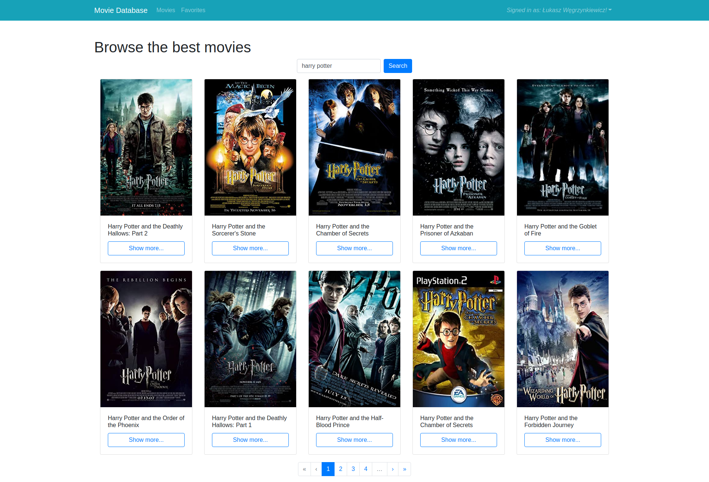

# Movie Database

## Requirements

```
npm - version 6.14.10
docker-ce - version 20.10.1
docker-compose - version 1.27.4
```

## How to install?

```bash
# install node dependencies
$ npm install
packages/frontend$ npm install
packages/backend$ npm install

# build frontend webpack assets
packages/frontend$ webpack

# run all required containers
$ docker-compose up --force-recreate
```

Application have to run on url `http://localhost:8000` due to hardcode of the authentication token.

## If the installation fails


